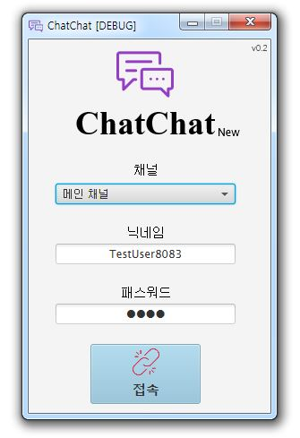
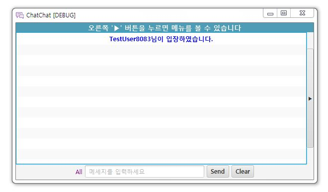
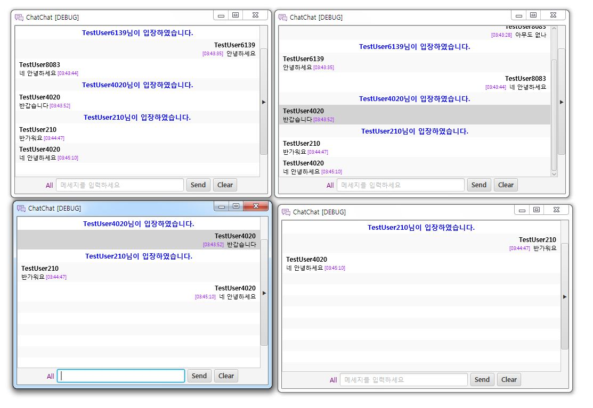
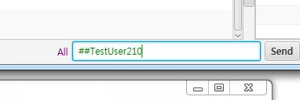
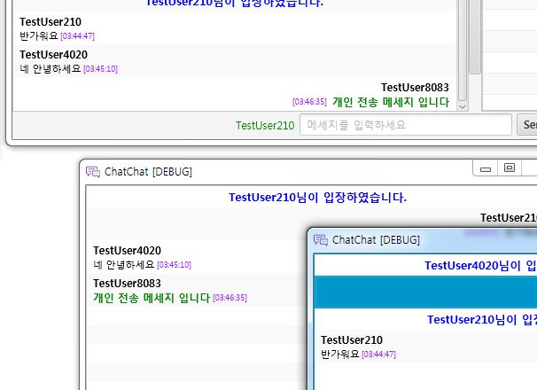
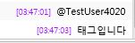

# ChatChat #
* 이 문서는 한국어를 기준으로 작성되었습니다.
 - This document was written in Korean.
---

## Runtime Environment ##
* Java Development Kit 1.8
* Java Runtime Environment 1.8
* JavaFx 8

## ChatChat 소개 ##
Java 의 소켓 통신을 활용한 간단한 채팅 클라이언트입니다.
 - ChatChatClient
 - ChatChatServer

위 2개의 프로젝트로 구성되어 있으며, Server 패키지에서 구동 한 Server Socket 에 연결하여 통신을 구축합니다.

클라이언트에는 이미 서버 IP 주소와 PORT 가 입력되어 있습니다.
최초 로그인시 클라이언트는 서버에 현재 클라이언트의 버전, 사용자이름, 채널 패스워드 정보를 전송하여 해당 값을 확인 후 서버는 채널 접속 인가 여부를 확인 후 클라이언트에게 접속 정보를 발송하게 됩니다.

각 채팅방은 서로 통신이 가능하며 사용자 입장 시 환영 메세지와 대화가 가능합니다.
채팅 시 전송되는 메세지는 다음과 같은 형식으로 통신합니다. 
`[Plag][ClientHashKey][Name][Message]`
각 클라이언트는 서버에게 메세지를 전송하고 서버를 해당 메세지를 각 클라이언트에게 BroadCasting 형식으로 전송합니다.

우측 메뉴 버튼을 통해 메뉴 화면과 사용자 리스트를 확인 할 수 있습니다.

메뉴창에서 닉네임 변경, 상태 변경, 알림, 채팅 내리기 기능, 항상 위에 옵션 등을 지정 할 수 있습니다.

위와 같이 클라이언트간 귓속말 통신이 가능합니다, 지정되지 않은 클라이언트는 볼 수 없습니다.

위와 같이 사용자를 태그할 수 있습니다.

어드민 기능 중 하나인 공지사항 전파 입니다, 그 이외에 사용자 추방, 

## 현재 지원중인 기능 ##
 * 클라이언트간 통신, 서버 접속
 * 닉네임 변경
 * 채팅복사 기능
 * 현재 상태 변경 기능
 * 개인 메세지 전송 기능
 * 알림, 공지사항(상단바 공지, 채팅 공지) 기능
 * 입/퇴장 메세지
 * 관리자 기능 (추방, 메세지 삭제, 공지사항 전파)

---
## 추후 지원 기능 ##
 * 파일 전송/리스트 확인
 * 서버 비정상 동작 시 자동 재접속 기능 (Heartbeat 구현)
 * 클라이언트 메모리 누수 문제 해결